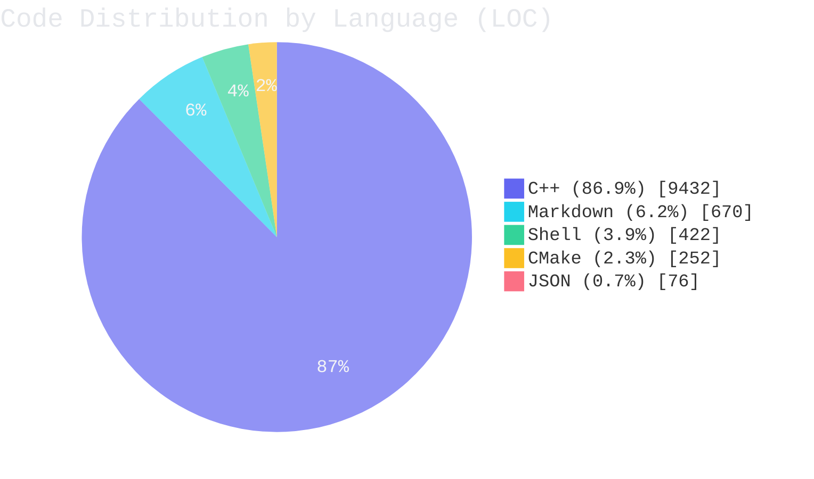

# term4k

[Chinese documentation / 中文文档](documents/README_zh_CN.md)

<p align="center">
  
  
  
  
  
  
  
  
  
  
</p>

## Documentation

- [Architecture Overview](documents/ARCHITECTURE.md)

term4k is a terminal-based rhythm game project written in C++20.

It includes:

- chart parsing and gameplay timing logic
- user/account data management
- per-user runtime configuration persistence
- localization support (`en_US`, `zh_CN`)
- unit tests for core modules

<!-- README_STATS:START -->
## Live Code Statistics

> Auto-updated by `.github/workflows/readme-stats.yml`.

> Chart theme preset: `dark` + `default`.
> Switch quickly: `python3 scripts/update_readme_stats.py --theme light --style neon`.

**Total code lines:** `10,852`  
**Class/Struct definitions (C++):** `86`  
**Stack object declarations (C++, heuristic):** `392`  
**Heap allocations via `new` (C++, heuristic):** `0`  
**`make_shared`/`make_unique` calls (C++, heuristic):** `1`

### Distribution Chart


<!-- README_STATS:END -->

## Install (Recommended)

Use the installer script in the project root:

```bash
./install.sh
```

The script will:

1. configure and build a Release package with CMake/CPack
2. detect your package manager (`apt`, `dnf`, `yum`, or `zypper`)
3. install the generated package automatically
4. fall back to `cmake --install` when no supported package manager is found

After installation:

```bash
term4k
```

## Remote Install (No Full Clone)

If you only download script files via `curl` or `wget`, install with:

```bash
curl -fsSL "https://raw.githubusercontent.com/TheBadRoger/term4k/main/install.sh" -o install.sh
sh install.sh --source-url "https://github.com/TheBadRoger/term4k/archive/refs/heads/main.tar.gz"
```

```bash
wget -qO install.sh "https://raw.githubusercontent.com/TheBadRoger/term4k/main/shell/install.sh"
sh install.sh --source-url "https://github.com/TheBadRoger/term4k/archive/refs/heads/main.tar.gz"
```

## Uninstall

To completely remove term4k from your system:

```bash
./uninstall.sh
```

Use non-interactive mode when needed:

```bash
./uninstall.sh --yes
```

Safe mode (remove program only, keep user data):

```bash
./uninstall.sh --keep-user-data
```

Remote uninstall (no clone):

```bash
curl -fsSL "https://raw.githubusercontent.com/TheBadRoger/term4k/main/shell/uninstall.sh" -o uninstall.sh
sh uninstall.sh --yes --keep-user-data
```

```bash
wget -qO uninstall.sh "https://raw.githubusercontent.com/TheBadRoger/term4k/main/shell/uninstall.sh"
sh uninstall.sh --yes --keep-user-data
```

## Update

Local update:

```bash
./update.sh
```

Remote update (no clone):

```bash
curl -fsSL "https://raw.githubusercontent.com/TheBadRoger/term4k/main/shell/update.sh" -o update.sh
sh update.sh --install-script-url "https://raw.githubusercontent.com/TheBadRoger/term4k/main/shell/install.sh" --source-url "https://github.com/TheBadRoger/term4k/archive/refs/heads/main.tar.gz"
```

```bash
wget -qO update.sh "https://raw.githubusercontent.com/TheBadRoger/term4k/main/shell/update.sh"
sh update.sh --install-script-url "https://raw.githubusercontent.com/TheBadRoger/term4k/main/shell/install.sh" --source-url "https://github.com/TheBadRoger/term4k/archive/refs/heads/main.tar.gz"
```

## Manual Build (Optional)

```bash
cmake -S . -B cmake-build-release -DCMAKE_BUILD_TYPE=Release
cmake --build cmake-build-release -j
./cmake-build-release/term4k
```

## Packaging Options

By default, CPack generates DEB packages. RPM generation is controlled by `TERM4K_ENABLE_RPM` and requires `rpmbuild`.

```bash
# DEB only
cmake -S . -B cmake-build-release -DCMAKE_BUILD_TYPE=Release -DTERM4K_ENABLE_RPM=OFF
cmake --build cmake-build-release --target package -j
```

```bash
# DEB + RPM (when rpmbuild is available)
cmake -S . -B cmake-build-release -DCMAKE_BUILD_TYPE=Release -DTERM4K_ENABLE_RPM=ON
cmake --build cmake-build-release --target package -j
```

```bash
# CI strict mode: fail configure if RPM is requested but rpmbuild is missing
cmake -S . -B cmake-build-release -DCMAKE_BUILD_TYPE=Release -DTERM4K_ENABLE_RPM=ON -DTERM4K_STRICT_RPM_CHECK=ON
cmake --build cmake-build-release --target package -j
```
