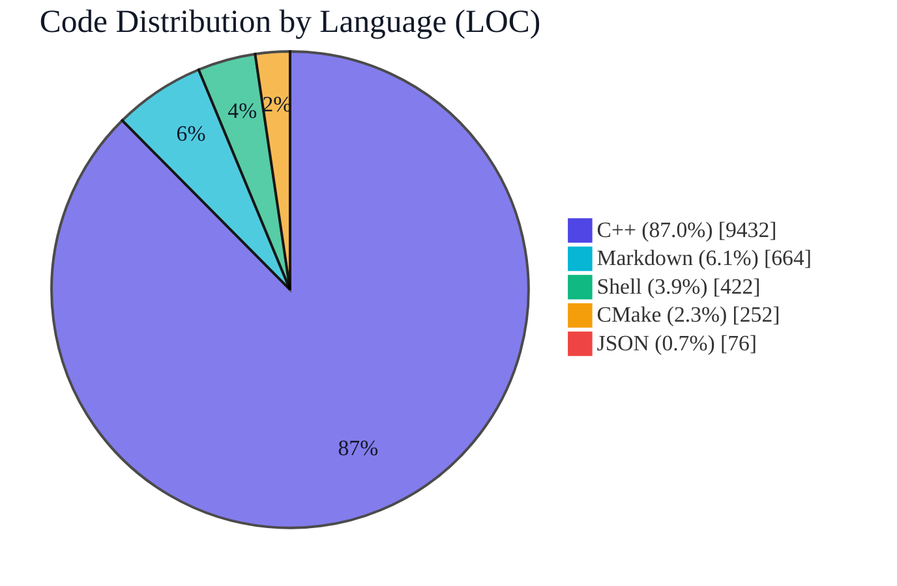

# term4k（中文说明）

[English documentation / 英文文档](../README.md)

<p align="center">
  
  
  
  
  
  
  
  
  
  
</p>

## 文档导航

- [架构与模块分工](./ARCHITECTURE_zh_CN.md)

term4k 是一个基于 C++20 的终端节奏游戏项目。

主要能力包括：

- 谱面解析与节奏时序逻辑
- 用户/账户数据管理
- 用户级运行配置持久化
- 多语言支持（`en_US`、`zh_CN`）
- 核心模块单元测试

<!-- README_STATS:START -->
## 实时代码统计

> 由 `.github/workflows/readme-stats.yml` 自动更新。

**代码总行数：** `10,846`  
**类/结构体定义数量（C++）：** `86`  
**栈对象声明数量（C++，启发式）：** `392`  
**`new` 堆分配次数（C++，启发式）：** `0`  
**`make_shared`/`make_unique` 调用次数（C++，启发式）：** `1`

### 分布图


<!-- README_STATS:END -->

## 安装（推荐）

在项目根目录执行：

```bash
./install.sh
```

脚本会自动：

1. 使用 CMake/CPack 进行 Release 构建和打包
2. 检测系统包管理器（`apt`、`dnf`、`yum`、`zypper`）
3. 安装生成的软件包
4. 在不支持的环境下回退到 `cmake --install`

安装完成后运行：

```bash
term4k
```

## 远程安装（无需完整克隆仓库）

仅下载脚本也可完成安装：

```bash
curl -fsSL "https://raw.githubusercontent.com/TheBadRoger/term4k/main/shell/install.sh" -o install.sh
sh install.sh --source-url "https://github.com/TheBadRoger/term4k/archive/refs/heads/main.tar.gz"
```

```bash
wget -qO install.sh "https://raw.githubusercontent.com/TheBadRoger/term4k/main/shell/install.sh"
sh install.sh --source-url "https://github.com/TheBadRoger/term4k/archive/refs/heads/main.tar.gz"
```

## 卸载

彻底卸载（包含程序与用户数据）：

```bash
./uninstall.sh
```

无交互模式：

```bash
./uninstall.sh --yes
```

安全模式（仅卸载程序，保留用户数据）：

```bash
./uninstall.sh --keep-user-data
```

远程卸载（无需克隆仓库）：

```bash
curl -fsSL "https://raw.githubusercontent.com/TheBadRoger/term4k/main/shell/uninstall.sh" -o uninstall.sh
sh uninstall.sh --yes --keep-user-data
```

```bash
wget -qO uninstall.sh "https://raw.githubusercontent.com/TheBadRoger/term4k/main/shell/uninstall.sh"
sh uninstall.sh --yes --keep-user-data
```

## 更新

本地更新：

```bash
./update.sh
```

远程更新（无需克隆仓库）：

```bash
curl -fsSL "https://raw.githubusercontent.com/TheBadRoger/term4k/main/shell/update.sh" -o update.sh
sh update.sh --install-script-url "https://raw.githubusercontent.com/TheBadRoger/term4k/main/shell/install.sh" --source-url "https://github.com/TheBadRoger/term4k/archive/refs/heads/main.tar.gz"
```

```bash
wget -qO update.sh "https://raw.githubusercontent.com/TheBadRoger/term4k/main/shell/update.sh"
sh update.sh --install-script-url "https://raw.githubusercontent.com/TheBadRoger/term4k/main/shell/install.sh" --source-url "https://github.com/TheBadRoger/term4k/archive/refs/heads/main.tar.gz"
```

## 手动构建（可选）

```bash
cmake -S . -B cmake-build-release -DCMAKE_BUILD_TYPE=Release
cmake --build cmake-build-release -j
./cmake-build-release/term4k
```
