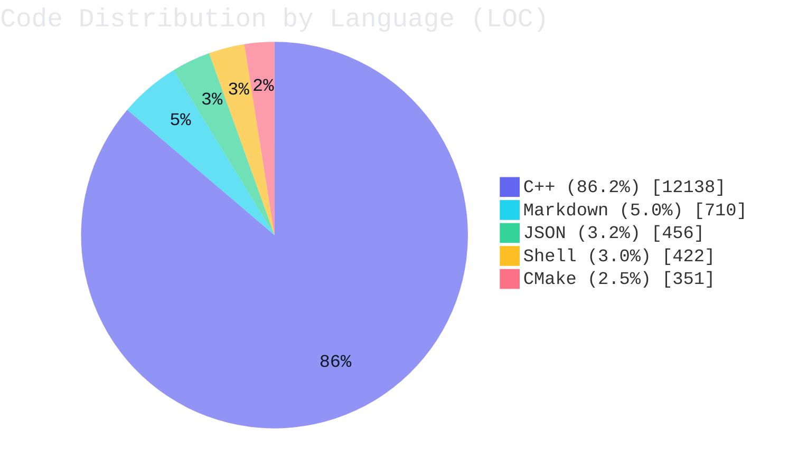

# term4k（中文说明）

[English documentation / 英文文档](../README.md)

<p align="center">
  <strong>项目信息</strong><br>
  <a href="https://github.com/TheBadRoger/term4k/blob/main/LICENSE"></a>
  <a href="https://en.cppreference.com/w/cpp/20"></a>
  <a href="https://github.com/TheBadRoger/term4k/commits/main"></a>
  <a href="https://github.com/TheBadRoger/term4k"></a>
  <br><br>
  <strong>代码统计</strong><br>
  <a href="https://github.com/TheBadRoger/term4k#%E5%AE%9E%E6%97%B6%E4%BB%A3%E7%A0%81%E7%BB%9F%E8%AE%A1"></a>
  <a href="https://github.com/TheBadRoger/term4k#%E5%AE%9E%E6%97%B6%E4%BB%A3%E7%A0%81%E7%BB%9F%E8%AE%A1"></a>
  <a href="https://github.com/TheBadRoger/term4k#%E5%AE%9E%E6%97%B6%E4%BB%A3%E7%A0%81%E7%BB%9F%E8%AE%A1"></a>
  <br><br>
  <strong>CI 状态</strong><br>
  <a href="https://github.com/TheBadRoger/term4k/actions/workflows/build.yml"></a>
  <a href="https://github.com/TheBadRoger/term4k/actions/workflows/unit-tests.yml"></a>
</p>

## 文档导航

- [架构与模块分工](./ARCHITECTURE_zh_CN.md)

term4k 是一个基于 C++20 的节奏游戏核心逻辑项目。

当前代码库为无内置 UI 的 headless 形态。

主要能力包括：

- 谱面解析与节奏时序逻辑
- 用户/账户数据管理
- 用户级运行配置持久化
- 多语言支持（`en_US`、`zh_CN`）
- 核心模块单元测试

<!-- README_STATS:START -->
## 实时代码统计

> 最后更新时间：`2026-04-16 12:47:47`（UTC+8）。

| 指标 | 数值 |
| --- | ---: |
| 代码总行数 | `14,077` |
| 类/结构体定义数量（C++） | `93` |
| 函数定义数量（C++，启发式） | `467` |
| 栈对象声明数量（C++，启发式） | `600` |
| 静态变量声明数量（C++，启发式） | `18` |
| `new` 堆分配次数（C++，启发式） | `0` |
| `make_shared`/`make_unique` 调用次数（C++，启发式） | `1` |

### 分布图


<!-- README_STATS:END -->

## 安装（推荐）

在项目根目录执行：

```bash
./install.sh
```

脚本会自动：

1. 使用 CMake/CPack 进行 Release 构建和打包
2. 检测系统包管理器（`apt`、`dnf`、`yum`、`zypper`）
3. 安装生成的软件包
4. 在不支持的环境下回退到 `cmake --install`

安装完成后运行：

```bash
term4k
```

## 远程安装（无需完整克隆仓库）

仅下载脚本也可完成安装：

```bash
curl -fsSL "https://raw.githubusercontent.com/TheBadRoger/term4k/main/shell/install.sh" -o install.sh
sh install.sh --source-url "https://github.com/TheBadRoger/term4k/archive/refs/heads/main.tar.gz"
```

```bash
wget -qO install.sh "https://raw.githubusercontent.com/TheBadRoger/term4k/main/shell/install.sh"
sh install.sh --source-url "https://github.com/TheBadRoger/term4k/archive/refs/heads/main.tar.gz"
```

## 卸载

彻底卸载（包含程序与用户数据）：

```bash
./uninstall.sh
```

无交互模式：

```bash
./uninstall.sh --yes
```

安全模式（仅卸载程序，保留用户数据）：

```bash
./uninstall.sh --keep-user-data
```

远程卸载（无需克隆仓库）：

```bash
curl -fsSL "https://raw.githubusercontent.com/TheBadRoger/term4k/main/shell/uninstall.sh" -o uninstall.sh
sh uninstall.sh --yes --keep-user-data
```

```bash
wget -qO uninstall.sh "https://raw.githubusercontent.com/TheBadRoger/term4k/main/shell/uninstall.sh"
sh uninstall.sh --yes --keep-user-data
```

## 更新

本地更新：

```bash
./update.sh
```

远程更新（无需克隆仓库）：

```bash
curl -fsSL "https://raw.githubusercontent.com/TheBadRoger/term4k/main/shell/update.sh" -o update.sh
sh update.sh --install-script-url "https://raw.githubusercontent.com/TheBadRoger/term4k/main/shell/install.sh" --source-url "https://github.com/TheBadRoger/term4k/archive/refs/heads/main.tar.gz"
```

```bash
wget -qO update.sh "https://raw.githubusercontent.com/TheBadRoger/term4k/main/shell/update.sh"
sh update.sh --install-script-url "https://raw.githubusercontent.com/TheBadRoger/term4k/main/shell/install.sh" --source-url "https://github.com/TheBadRoger/term4k/archive/refs/heads/main.tar.gz"
```

## 手动构建（可选）

```bash
cmake -S . -B cmake-build-release -DCMAKE_BUILD_TYPE=Release
cmake --build cmake-build-release -j
./cmake-build-release/term4k
```

## 依赖管理策略

第三方依赖统一由 `CMake` 管理，并与项目源码分离。

- 音频核心：`miniaudio`
- 单元测试：`Catch2`
- TUI（可选）：`FTXUI`（通过 `TERM4K_ENABLE_TUI=ON` 启用）

默认使用 `FetchContent` 自动拉取依赖。

```bash
# 默认模式：FetchContent
cmake -S . -B cmake-build-release -DCMAKE_BUILD_TYPE=Release
```

```bash
# 优先使用系统依赖，找不到时回退到 FetchContent
cmake -S . -B cmake-build-release -DCMAKE_BUILD_TYPE=Release -DTERM4K_USE_SYSTEM_DEPS=ON
```

